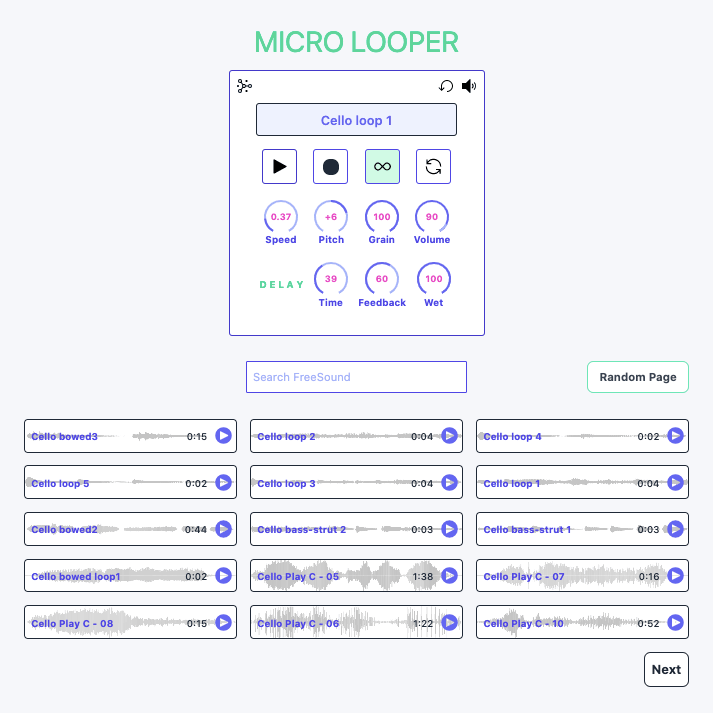

Micro Looper is an app for generating infinite sounds.

To use, simply search for samples via FreeSound and click on a result to load into the player, where you can loop, reverse, manipulate the speed, pitch, grain, delay speed and delay feedback amount of the current loaded sample. You can audition results by clicking on the play icon on right side of each result.
Pressing the record button will record and automatically export whatever is playing and download as a wav file.

Click the Random Sound icon on the top left of the player to load a random sound into the player.

Click the Random Page button to load a random page of results from FreeSound.

Upcoming features:

- Filters
- More audio visualization
- Dark mode

Please create an issue if you encounter any problems.
